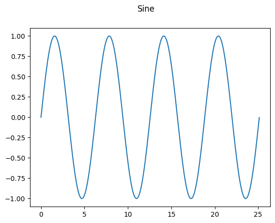

# nbdev-test-project

<!-- WARNING: THIS FILE WAS AUTOGENERATED! DO NOT EDIT! -->

## Getting started

Nbdev library tutorial: https://nbdev.fast.ai/tutorials/tutorial.html
<br> Windows support is partial (see Install section in nbdev library
description) <br> To develop this project Ubuntu 22.04 LTS was used <br>

Very simplified workflow to create nbdev project 1) Create repository in
Github and enable github pages in repository settings 2) Clone
repository to specified directory 3) Create venv and install nbdev
package 4) Initialize nbdev repository with help of command: ndev_new 5)
Make some changes 6) Export files with nbdev_export 7) Create docs (and
also update readme file) with command nbdev_docs 8) Add all necessary
files (inlcuding .github) to index and make comming 9) Push changes 10)
See deployment process in Actions tab

## How to use

``` python
import matplotlib.pyplot as plt
import numpy as np
import math
from nbdev_test_project.graph import Graph as Graph
from nbdev_test_project.plot import SimplePlot as MyPlot
import ipywidgets as widgets
```

### Plot one graph

``` python
X = np.arange(0, math.pi * 8, 0.01)
Y1 = np.sin(X)
plot = MyPlot(plt, 1, 1, (6, 4))
graph = Graph(X, Y1, "Sine")
plot.add_graph(graph)
plot.plot_first_graph()
```



### Plot serveral graphs

``` python
X = np.arange(0, math.pi * 8, 0.01)
Y1 = np.sin(X)
Y2 = np.cos(X)
Y3 = np.tan(X)
plot = MyPlot(plt, 2,2, (12, 7))
plot.add_graph(Graph(X, Y1, "Sine"))
plot.add_graph(Graph(X, Y2, "Cosine"))
plot.add_graph(Graph(X, Y3, "Tangent"))
plot.plot_all_graphs()
```


## Interactive demo

> Attention! only works in jupyter lab/notebook. Docks in github pages
> will show only the result of exported action althoug it is possible to
> change elements in the dropbox. See discussion
> https://github.com/quarto-dev/quarto-cli/discussions/6496
> (particularly the answer from the person with nickname ‘cscheid’)

``` python
def plotGraph(x, y, name):
    plot = MyPlot(plt, 1, 1, (6, 4))
    graph = Graph(x, y, name)
    plot.add_graph(graph)
    plot.plot_first_graph()
```

``` python
X = np.arange(0, math.pi * 8, 0.01)
@widgets.interact(v = [("Sine", 1), ("Cosine", 2), ("Tangent", 3) ])
def plotGraphs(v):
    if v == 1:
        Y1 = np.sin(X)
        plotGraph(X, Y1, "Sine")
    elif v == 2:
        Y2 = np.cos(X)
        plotGraph(X, Y2, "Cosine")
    elif v == 3:
        Y3 = np.tan(X)
        plotGraph(X, Y3, "Tangent")
```

    interactive(children=(Dropdown(description='v', options=(('Sine', 1), ('Cosine', 2), ('Tangent', 3)), value=1)…
